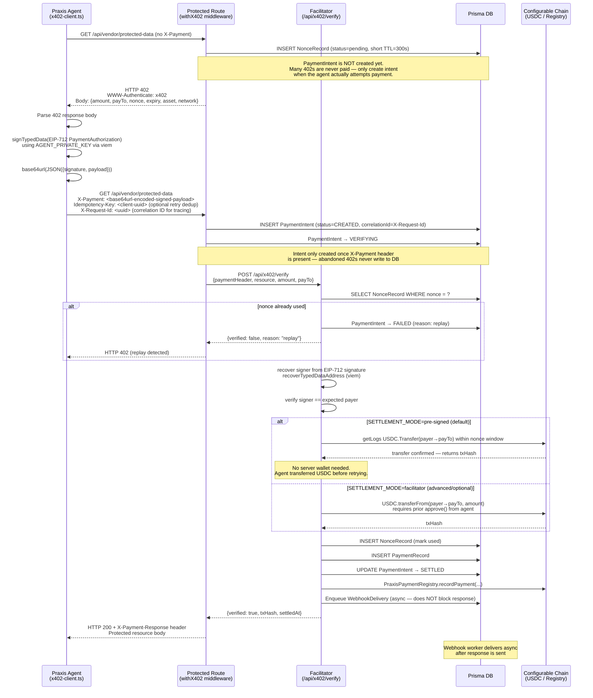
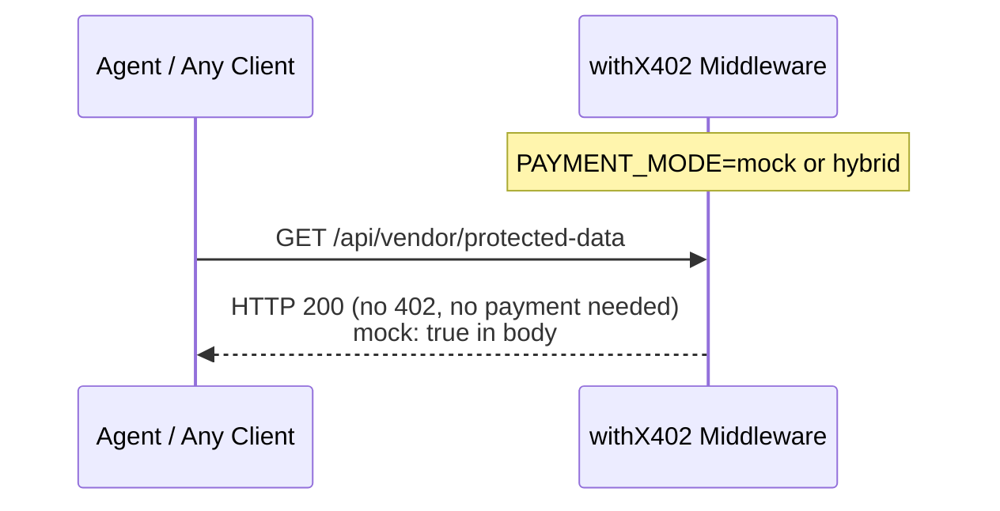
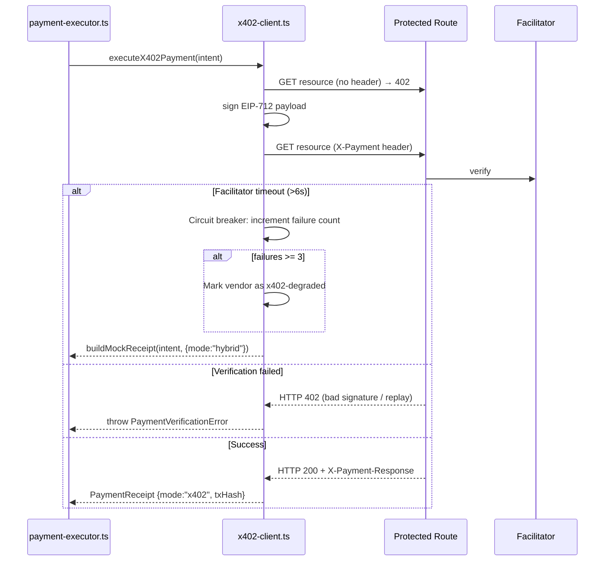

# Design Document: x402 Payment Gateway

## Overview

Praxis is a complete blockchain payment gateway. It supports two primary payment flows:

1. **Invoice Engine** (primary merchant flow) — Merchants create invoices with a payment link. Customers pay on-chain via USDC. This is the main flow for human-initiated B2B and merchant payments. *(Planned in ROADMAP §4)*
2. **x402 Protocol** (agent-to-agent flow) — Any API endpoint can be protected with HTTP 402. AI agents and automated systems pay per-request using EIP-712 signed USDC authorizations. This is the primary flow for M2M autonomous payments.

This document covers the **x402 Payment Gateway** — the infrastructure layer that makes any Next.js API route payable with a single line of code. The Invoice Engine is a separate, higher-level product built on top of this foundation.

**x402 in one sentence:** The route responds with HTTP 402 when no payment is present; the Praxis agent detects it, signs an EIP-712 payment authorization, retries with an `X-Payment` header, and the server-side Facilitator verifies the signature, enforces replay protection, confirms USDC settlement, and grants access.

This design slots directly into the existing Praxis payment pipeline. The `payment-executor.ts` → `x402-client.ts` flow is the agent-side client. `payment-firewall.ts` continues to act as the deterministic pre-payment gate. New components add the vendor-side middleware, the Facilitator/Verifier, settlement logic, a `PaymentIntent` lifecycle layer, and a gateway dashboard UI. Mock mode is fully preserved — when `PAYMENT_MODE=mock` or `PAYMENT_MODE=hybrid`, all new middleware components short-circuit and return data freely, so the development workflow is unchanged.

## Architecture

```mermaid
graph TD
    subgraph Agent["Praxis Agent (Client Side)"]
        PE[payment-executor.ts]
        X4[x402-client.ts]
        EIP[EIP-712 Signer<br/>viem signTypedData]
    end

    subgraph Gateway["x402 Gateway Layer (New)"]
        MW[withX402 Middleware<br/>src/gateway/with-x402.ts]
        PI[PaymentIntent<br/>lifecycle tracker]
        FAC[Facilitator/Verifier<br/>app/api/x402/verify/route.ts]
        SETTLE[Settlement Engine<br/>src/gateway/settlement.ts]
        WQ[Webhook Queue<br/>async delivery]
        NONCE[Nonce Registry<br/>NonceRecord model]
    end

    subgraph Vendor["Protected Vendor Routes"]
        VPD[/api/vendor/protected-data]
        ANY[Any Wrapped Route]
    end

    subgraph DB["Database (Prisma/SQLite)"]
        NR[NonceRecord]
        PINT[PaymentIntent]
        PR[PaymentRecord]
        EL[EndpointConfig]
        WD[WebhookDelivery queue]
    end

    subgraph Chain["Configurable Chain (default: Base Sepolia)"]
        USDC[USDC Contract<br/>from ChainConfig]
        REG[PraxisPaymentRegistry]
    end

    subgraph UI["Gateway Dashboard"]
        DASH[app/gateway/page.tsx]
        HIST[Payment History]
        CFG[Endpoint Config]
        METRIC[Success Rate / Avg Settlement / Replays Blocked]
    end

    PE -->|"PAYMENT_MODE=x402"| X4
    X4 -->|"GET (no header)"| MW
    MW -->|"HTTP 402 + WWW-Authenticate"| X4
    X4 --> EIP
    EIP -->|"X-Payment header"| MW
    MW -->|"POST /api/x402/verify"| FAC
    FAC -->|"nonce lookup"| NR
    FAC -->|"create/update PaymentIntent"| PINT
    FAC -->|"on-chain check"| USDC
    FAC -->|"settle or verify"| SETTLE
    SETTLE -->|"writeContract"| USDC
    SETTLE -->|"anchorPayment"| REG
    FAC -->|"write record"| PR
    FAC -->|"enqueue webhook"| WQ
    WQ -.->|"async deliver"| WD
    MW -->|"grant access"| VPD
    MW -->|"grant access"| ANY
    DASH --> PR
    DASH --> PINT
    DASH --> EL
    DASH --> NR
```

## Sequence Diagrams

### Full 402 → Pay → Retry → Verify → Grant Cycle



### Mock / Development Mode Short-Circuit



### Agent Retry with Circuit Breaker




## Components and Interfaces

### Component 1: `withX402` Middleware

**File:** `src/gateway/with-x402.ts`

**Purpose:** A higher-order function that wraps any Next.js App Router `GET` (or `POST`) handler and adds x402 payment enforcement. Single-line protection for any route.

**Interface:**

```typescript
interface X402Config {
  amountUsdc: string          // e.g. "1.00" — string, never number
  description: string
  resource?: string           // override resource URL (defaults to request URL)
  asset?: string              // USDC contract address (from ChainConfig if omitted)
  payTo?: string              // receiver address (from env if omitted)
  network?: string            // CAIP-2 (from ChainConfig if omitted)
  nonceTtlSeconds?: number    // nonce validity window (default 300)
  skipInMockMode?: boolean    // default true
  confirmations?: number      // blocks to wait before accepting settlement (default 1)
                              // set to 0 for "accept on submission" (faster, less safe)
                              // set to 2+ for higher-value endpoints
}
```

**Responsibilities:**
- Check `PAYMENT_MODE` env var — if `mock` or `hybrid`, call handler directly
- Check for `X-Payment` header on incoming request
- If absent: generate nonce, persist `NonceRecord`, return HTTP 402 — **no PaymentIntent written yet**
- If present:
  - Extract `Idempotency-Key` header (if present) — check for existing settled `PaymentIntent` with this key, return cached response if found (dedup retries)
  - Extract `X-Request-Id` header as `correlationId` — generated by client or auto-assigned here
  - Create `PaymentIntent` (status=`CREATED`) with `correlationId` and `idempotencyKey`
  - Transition to `VERIFYING`, call `POST /api/x402/verify`
- On `verified: true`: call handler, set `PaymentIntent → SETTLED`, attach `X-Payment-Response` and `X-Correlation-Id` to response
- On `verified: false`: set `PaymentIntent → FAILED`, return HTTP 402 with reason

---

### Component 2: Facilitator / Verifier

**File:** `app/api/x402/verify/route.ts`

**Purpose:** Server-side payment verification endpoint. Validates EIP-712 signatures, enforces nonce uniqueness (replay protection), checks or triggers USDC settlement, writes audit records.

**Interface:**

```typescript
// POST /api/x402/verify
interface VerifyRequest {
  paymentHeader:  string   // base64url-encoded signed payload
  resource:       string   // URL of the protected resource
  amountUsdc:     string   // expected amount (string)
  payTo:          string   // expected receiver address
  nonce:          string   // the nonce from the original 402 response
  network:        string   // CAIP-2 e.g. "eip155:84532"
  correlationId:  string   // from X-Request-Id — threads through all logs
  idempotencyKey?: string  // from Idempotency-Key — for dedup
  confirmations:  number   // from X402Config.confirmations (default 1)
}

interface VerifyResponse {
  verified:      boolean
  txHash:        string | null
  settledAt:     string | null
  payerAddress:  string | null
  correlationId: string        // echoed back — present in every response
  reason?:       string        // only when verified: false
}
```

**Responsibilities:**
- All log lines include `correlationId` — enables end-to-end tracing across middleware, verifier, settlement engine, and webhook queue
- Decode base64url payload → `{ signature, authorization: PaymentAuthorization }`
- Look up `NonceRecord` by nonce — reject if already `used` or `expired`
- `recoverTypedDataAddress` (viem) → verify recovered address matches `authorization.payer`
- Verify `authorization.payTo`, `authorization.amount`, `authorization.resource` against config
- Dispatch to `settlement.ts` with `confirmations` parameter
- Atomic DB transaction: mark `NonceRecord.status = "used"`, write `PaymentRecord`, update `PaymentIntent → SETTLED`
- Enqueue webhook asynchronously (does not block response)
- Write `AuditLog: "x402.payment_verified"` with `correlationId`

---

### Component 3: Settlement Engine

**File:** `src/gateway/settlement.ts`

**Purpose:** Handles two settlement modes — either verify a pre-signed on-chain USDC transfer, or trigger the transfer server-side.

**Interface:**

```typescript
type SettlementMode = "pre-signed" | "facilitator"

interface SettlementResult {
  txHash:        string | null
  confirmedAt:   string
  mode:          SettlementMode
  blockNumber:   bigint | null   // block where transfer was confirmed
}

export async function settlePayment(
  authorization:  PaymentAuthorization,
  mode:           SettlementMode,
  confirmations:  number,         // 0 = accept on submission, 1+ = wait for blocks
  correlationId:  string          // threaded through for log tracing
): Promise<SettlementResult>
```

**Settlement Mode: `pre-signed` (default)**
- Agent transfers USDC on-chain before retrying
- Facilitator calls `publicClient.getLogs` for `USDC.Transfer` events from `payer → payTo` within nonce window
- Amount comparison: `parseUnits(authorization.amount, 6)` via viem — pure string/BigInt, **no `parseFloat`**
- If `confirmations > 0`: waits for the transfer tx to reach `confirmations` blocks using `publicClient.waitForTransactionReceipt({ confirmations })`
- If `confirmations = 0`: accepts the Transfer log immediately on first sight (faster, lower safety margin)
- Chain RPC URL resolved from `getChainConfig(chainId)` — never hardcoded

**Settlement Mode: `facilitator` (advanced, optional)**
- Requires `GATEWAY_PRIVATE_KEY` env var
- Calls `walletClient.writeContract(USDC.transferFrom, [payer, payTo, amount])`
- Waits for `confirmations` blocks via `waitForTransactionReceipt`
- All amount values use `parseUnits` — no floating-point

---

### Component 4: EIP-712 Payment Authorization (Agent Side)

**File:** `src/gateway/eip712-signer.ts`

**Purpose:** Constructs and signs the typed EIP-712 `PaymentAuthorization` payload. Chain config is read from the centralized registry — no hardcoded chain IDs inside this file.

**Interface:**

```typescript
interface PaymentAuthorization {
  payer: string             // agent wallet address (checksummed)
  payTo: string             // vendor receiver address
  asset: string             // USDC contract address (from ChainConfig)
  network: string           // CAIP-2 network identifier (from ChainConfig)
  amount: string            // human-readable USDC string e.g. "1.00" — never Float
  amountAtomicUnits: string // amount * 10^6 as string — for on-chain BigInt comparison
  resource: string          // URL of the protected resource
  nonce: string             // nonce from the 402 response
  expiry: number            // Unix timestamp — nonce expiry
}

// EIP-712 domain — built at runtime from ChainConfig
const buildDomain = (chainId: number) => ({
  name: "PraxisX402",
  version: "1",
  chainId,  // resolved from ChainConfig — never hardcoded
})

export async function signPaymentAuthorization(
  authorization: PaymentAuthorization,
  privateKey: `0x${string}`,
  chainId: number           // always passed in from ChainConfig
): Promise<string>          // base64url({ signature, authorization })
```

---

### Component 5: Chain Configuration Registry

**File:** `src/gateway/chain-config.ts`

**Purpose:** Single source of truth for all chain-specific values. Every other gateway file imports from here — no other file hardcodes a chain ID, contract address, or explorer URL.

**Interface:**

```typescript
interface ChainConfig {
  chainId: number
  caip2: string               // e.g. "eip155:84532"
  name: string                // e.g. "Base Sepolia"
  rpcUrl: string              // from env
  usdcAddress: `0x${string}`  // USDC on this chain
  explorerUrl: string
  registryAddress?: `0x${string}`  // PraxisPaymentRegistry if deployed
  blockTimeMs: number         // for settlement wait estimation
}

export function getChainConfig(chainId?: number): ChainConfig
export function getDefaultChain(): ChainConfig  // reads DEFAULT_CHAIN_ID env var
export const SUPPORTED_CHAINS: Record<number, ChainConfig>
```

| Chain | chainId | Default |
|---|---|---|
| Base Sepolia | 84532 | ✅ default |
| Base Mainnet | 8453 | opt-in |

---

### Component 6: Nonce Registry

**Model:** `NonceRecord` (Prisma)

- `createNonce(config)` — generates UUID nonce, persists with TTL
- `consumeNonce(nonce)` — atomic check-and-mark in a single DB transaction
- Background cron marks nonces past `expiresAt` as `expired`

---

### Component 7: PaymentIntent Lifecycle Tracker

**File:** `src/gateway/payment-intent.ts`

**Purpose:** Sits between the incoming 402 and the final `PaymentRecord`. Tracks every state a payment passes through — enabling retries, debugging, and richer analytics.

**Lifecycle:**

```
NonceRecord CREATED (on 402)
       │
       │ (agent abandons → nonce expires → cleanup marks EXPIRED)
       │
       ▼ (agent sends X-Payment header)
PaymentIntent CREATED ──► VERIFYING ──► SETTLED
                               │
                               ▼
                             FAILED
```

**Key design decision — late intent creation:** `PaymentIntent` is only created when the `X-Payment` header arrives, not when the 402 is issued. This prevents DB bloat from abandoned 402s (bots, crawlers, network retries that never pay). The `NonceRecord` handles the 402 issuance side. Only genuine payment attempts write a `PaymentIntent`.

**Abandoned 402 cleanup:** The nonce cleanup cron marks `NonceRecord.status = "expired"` for any nonce past `expiresAt` that has no corresponding `PaymentIntent`. No intent row is ever written for these — zero DB waste.

| State | Set when |
|---|---|
| `CREATED` | `withX402` middleware receives X-Payment header and starts verification |
| `VERIFYING` | Immediately after `CREATED` — Facilitator begins signature + settlement check |
| `SETTLED` | USDC confirmed, access granted, `PaymentRecord` written |
| `FAILED` | Any verification error — `failureReason` set |

**Note:** The original `AUTHORIZED` state (agent signed but hasn't sent yet) is removed. Since we only create the intent on X-Payment receipt, that intermediate state is unnecessary and was the main source of orphaned records.

```typescript
export function createPaymentIntent(nonce: string, config: X402Config, correlationId: string): Promise<void>
export function transitionIntent(nonce: string, to: PaymentIntentStatus, meta?: object): Promise<void>
```

---

### Component 8: Async Webhook Queue

**File:** `src/gateway/webhook-queue.ts`

**Purpose:** Webhook delivery is enqueued *after* the payment response is sent — it never blocks the payment flow.

```typescript
export async function enqueueWebhook(
  event: string,
  payload: Record<string, unknown>,
  tenantId?: string
): Promise<void>  // writes WebhookDelivery row and returns immediately
```

Worker (`app/api/gateway/webhooks/process/route.ts`) runs on 30s cron:
- Picks up `status: "queued"` rows
- Delivers with HMAC-SHA256 signature (`X-Praxis-Signature`)
- Retry backoff: 1min → 5min → 30min → 2h (max 4), then `status: "dead"`

**Events:** `x402.payment.settled` · `x402.payment.failed` · `x402.replay.blocked` · `x402.intent.expired`

---

### Component 9: Gateway Dashboard

**File:** `app/gateway/page.tsx`

**Enhanced metrics:**

| Metric | Source |
|---|---|
| Total revenue (USDC) | `SUM(amountUsdc) WHERE status=SETTLED` |
| Success rate (%) | `SETTLED / CREATED * 100` rolling 24h |
| Avg settlement time | `AVG(settledAt - createdAt)` rolling 24h |
| Replay attacks blocked | `COUNT(AuditLog WHERE action=x402.replay_blocked)` rolling 24h |
| Pending intents | `COUNT(PaymentIntent WHERE status IN (CREATED,AUTHORIZED,VERIFYING))` |

**Sections:** KPI cards · Payment history · PaymentIntent lifecycle view · Endpoint config · Webhook delivery log


## Data Models

### New Prisma Models

#### `NonceRecord` — Replay Protection Registry

```prisma
model NonceRecord {
  id          String   @id @default(cuid())
  nonce       String   @unique          // crypto.randomUUID() — never reused
  resource    String                    // URL of the protected endpoint
  amountUsdc  String                    // expected payment amount (string, no floats)
  payTo       String                    // expected receiver address (checksummed)
  network     String                    // CAIP-2 e.g. "eip155:84532"
  status      String   @default("pending")  // "pending" | "used" | "expired"
  issuedAt    DateTime @default(now())
  expiresAt   DateTime                  // issuedAt + nonceTtlSeconds
  usedAt      DateTime?                 // set when status → "used"
  usedByTx    String?                   // txHash of the payment that consumed this nonce
  ipAddress   String?                   // IP that triggered the 402

  @@index([nonce])
  @@index([status])
  @@index([expiresAt])
}
```

**Validation Rules:**
- `nonce` is a UUID v4 generated server-side — never client-provided
- `expiresAt` is hard-bounded to `issuedAt + 300s` maximum
- Transition `pending → used` is atomic (checked within a single DB transaction)
- `pending → expired` is set by background cleanup for nonces past `expiresAt`

---

#### `PaymentRecord` — Verified Payment Ledger

```prisma
model PaymentRecord {
  id                String   @id @default(cuid())
  nonce             String   @unique
  paymentIntentId   String   @unique          // FK to PaymentIntent
  resource          String
  payerAddress      String                    // recovered from EIP-712 signature
  payTo             String
  amountUsdc        String                    // human-readable string e.g. "1.00" — never Float
  amountAtomicUnits String                    // e.g. "1000000" — for BigInt on-chain comparison
  asset             String                    // USDC contract address
  network           String                    // CAIP-2
  chainId           Int                       // numeric chain ID from ChainConfig
  signature         String
  txHash            String?
  settlementMode    String                    // "pre-signed" | "facilitator"
  verifiedAt        DateTime @default(now())
  tenantId          String?
  runId             String?

  @@index([resource])
  @@index([payerAddress])
  @@index([verifiedAt])
  @@index([tenantId])
}
```

**Validation Rules:**
- `amountUsdc` stored as string — never Float to avoid precision issues
- `amountAtomicUnits` is derived using `parseUnits(amountUsdc, 6)` from viem — this does pure string/BigInt math with no floating-point arithmetic whatsoever. Never use `parseFloat` or `* 1_000_000` for this conversion.
- Example: `parseUnits("1.50", 6)` → `1500000n` — exact, no float intermediary
- `nonce` and `paymentIntentId` must be consistent — written in the same DB transaction as `NonceRecord.status = "used"` and `PaymentIntent.status = "SETTLED"`

---

#### `PaymentIntent` — Lifecycle Tracker

```prisma
model PaymentIntent {
  id              String    @id @default(cuid())
  nonce           String    @unique
  correlationId   String?                     // from X-Request-Id header — for log tracing
  idempotencyKey  String?   @unique           // from Idempotency-Key header — dedup retries
  resource        String
  amountUsdc      String                      // string — never Float
  payTo           String
  payerAddress    String?                     // set when CREATED (recovered from sig)
  chainId         Int
  status          String    @default("CREATED")
  // CREATED | VERIFYING | SETTLED | FAILED
  failureReason   String?
  paymentRecordId String?                     // set when SETTLED
  createdAt       DateTime  @default(now())   // when X-Payment header first received
  verifyingAt     DateTime?
  settledAt       DateTime?
  failedAt        DateTime?
  expiresAt       DateTime                    // matches NonceRecord.expiresAt

  @@index([nonce])
  @@index([status])
  @@index([resource])
  @@index([createdAt])
  @@index([correlationId])
}
```

---

#### `EndpointConfig` — Gateway-Protected Route Registry

```prisma
model EndpointConfig {
  id              String   @id @default(cuid())
  resource        String   @unique
  amountUsdc      String                      // string — never Float
  description     String
  payTo           String
  asset           String                      // from ChainConfig — not hardcoded
  network         String                      // CAIP-2 from ChainConfig
  chainId         Int                         // numeric chain ID
  nonceTtlSeconds Int      @default(300)
  isActive        Boolean  @default(true)
  tenantId        String?
  createdAt       DateTime @default(now())
  updatedAt       DateTime @updatedAt

  @@index([resource])
  @@index([tenantId])
}
```

---

### Modified Existing Models

#### `PolicyConfig` — Add x402 Gateway Flags

```prisma
// Add to existing PolicyConfig model:
  allowX402Gateway    Boolean @default(true)
  x402SettlementMode  String  @default("pre-signed")  // "pre-signed" | "facilitator"
  x402MaxAmountUsdc   String  @default("100.00")      // String — was Float, now String
```

**Note:** `x402MaxAmountUsdc` changed from `Float` to `String`. All amount comparisons use string-parsed BigInt arithmetic.

#### `Run` — No Changes Required

`PaymentRecord.runId` optionally links back to a `Run` for runs that went through `payment-executor.ts → x402-client.ts`. The existing `Run.receiptJson` stores the `PaymentReceipt` as before.


## Key API Routes

### New Gateway Routes

| Method | Route | Auth | Purpose |
|--------|-------|------|---------|
| POST | `/api/x402/verify` | Internal HMAC | Facilitator: verify X-Payment, transition PaymentIntent, settle |
| GET | `/api/gateway/endpoints` | `key:manage` | List EndpointConfig records |
| POST | `/api/gateway/endpoints` | `key:manage` | Register protected endpoint |
| PATCH | `/api/gateway/endpoints/[id]` | `key:manage` | Update amount, payTo, description |
| DELETE | `/api/gateway/endpoints/[id]` | `key:manage` | Deactivate |
| GET | `/api/gateway/payments` | `key:manage` | Paginated PaymentRecord + PaymentIntent list |
| GET | `/api/gateway/payments/[id]` | `key:manage` | Payment detail with full lifecycle |
| GET | `/api/gateway/analytics` | `key:manage` | Revenue, success rate, avg settlement time, replays blocked |
| GET | `/api/gateway/intents` | `key:manage` | PaymentIntent list with lifecycle state |
| POST | `/api/gateway/nonces/cleanup` | Internal cron | Mark expired NonceRecords and PaymentIntents |
| POST | `/api/gateway/webhooks/process` | Internal cron | Process queued WebhookDelivery rows |

### New Gateway Dashboard Pages

| Page | Route | Purpose |
|------|-------|---------|
| Gateway Overview | `app/gateway/page.tsx` | KPI cards + recent payments + lifecycle funnel |
| Payment History | `app/gateway/payments/page.tsx` | Full paginated history |
| Intent Tracker | `app/gateway/intents/page.tsx` | Live PaymentIntent pipeline view |
| Endpoint Config | `app/gateway/endpoints/page.tsx` | Manage protected endpoints |
| Webhook Logs | `app/gateway/webhooks/page.tsx` | Delivery status + retry history |


## Integration with Existing Praxis Infrastructure

### Payment Executor Integration

`payment-executor.ts` remains the single entry point. The x402 flow is:

```
executePayment(intent)
  └── PAYMENT_MODE=x402
        └── executeX402Payment(intent)           ← x402-client.ts (enhanced)
              └── eip712Signer.signPaymentAuthorization()  ← NEW
              └── withX402 middleware on vendor route
              └── FAC verifies → PaymentRecord written
              └── returns PaymentReceipt {mode:"x402", txHash}
```

The `x402-client.ts` enhancement:
1. `res402 = GET /api/vendor/protected-data` — gets nonce + payment details from 402 body
2. `paymentHeader = signPaymentAuthorization(authorization, process.env.AGENT_PRIVATE_KEY)`
3. `paidRes = GET /api/vendor/protected-data` with `X-Payment: paymentHeader`
4. On 200: extract `X-Payment-Response` header, build `PaymentReceipt`
5. Circuit breaker: `vendorFailureCounts.get(vendorKey)` — after 3 failures, degrade to hybrid

### Payment Firewall Integration

`payment-firewall.ts` is unchanged. It runs BEFORE `executePayment()` as the deterministic 5-check gate. The x402 flow only begins after the firewall approves the intent. This guarantees:
- Budget guard passed → payment amount is within tenant limits
- Policy guard passed → vendor is on the allowlist
- Proof hash matches → the intent hasn't been tampered with

The Facilitator's verification is an additional layer (signature + nonce + on-chain) that operates at the transport level, not the business logic level.

### Run Store Integration

When `x402-client.ts` gets a successful `PaymentReceipt`:
- `runStore.setPayment(runId, receipt)` stores the receipt (existing behavior)
- `receipt.x402PaymentHeader` captures the raw signed header for audit
- `PaymentRecord.runId` links the gateway payment record back to the Run

### Audit Log Integration

New audit actions written via existing `AuditLog` model:

| Action | When |
|--------|------|
| `x402.nonce_issued` | 402 response sent, nonce created |
| `x402.payment_verified` | Facilitator verified successfully |
| `x402.payment_failed` | Signature invalid / nonce expired / amount mismatch |
| `x402.replay_blocked` | Nonce already used — replay attack detected |
| `x402.settlement_failed` | On-chain USDC verification or transfer failed |
| `x402.endpoint_registered` | New EndpointConfig created |
| `x402.endpoint_updated` | EndpointConfig modified |


## Security Considerations

### Replay Attack Prevention

The nonce system is the primary replay protection mechanism:

- Every 402 response includes a server-generated UUID nonce with a hard TTL (default 300s)
- The `NonceRecord` table tracks every issued nonce and its status
- The Facilitator marks a nonce as `used` atomically (inside a DB transaction) before returning `verified: true`
- If two concurrent requests arrive with the same nonce, only one wins the atomic update — the second gets `verified: false, reason: "nonce already used"`
- Nonces are bound to a specific `resource`, `amountUsdc`, and `payTo` — a valid payment for endpoint A cannot be replayed against endpoint B
- Expired nonces (past `expiresAt`) are permanently rejected regardless of payment status

### EIP-712 Signature Verification

EIP-712 structured data signing prevents several classes of attacks vs plain message signing:

- **Domain separation:** `name: "PraxisX402", version: "1", chainId: 84532` — signatures are chain-specific and app-specific; a valid signature from a different app or chain is rejected
- **Typed data:** the `PaymentAuthorization` type definition means the user/agent signs a structured object, not an opaque blob — the signer knows exactly what they're authorizing
- **Recoverable address:** `recoverTypedDataAddress` (viem) extracts the signer's address — the Facilitator verifies `recoveredAddress == authorization.payer`
- **Amount binding:** `amount` is in the signed payload — a vendor cannot retroactively charge more than the signed amount
- **Resource binding:** `resource` is in the signed payload — signatures are not transferable across endpoints

### Amount Validation

- `amountUsdc` is stored and compared as a string throughout the gateway to avoid floating-point precision attacks
- The Facilitator compares `authorization.amount === config.amountUsdc` (string equality) before settling
- For on-chain verification (pre-signed mode), the Transfer log amount is compared using BigInt arithmetic (USDC has 6 decimals)
- `PolicyConfig.x402MaxAmountUsdc` provides a tenant-level ceiling on how much a single x402 payment can request — enforced by the Facilitator before any settlement

### Facilitator Internal Endpoint Security

`POST /api/x402/verify` is not a public API — it is called only by `withX402` middleware within the same process:

- The middleware passes an HMAC-SHA256 token (`X-Gateway-Token: HMAC(GATEWAY_INTERNAL_SECRET, nonce)`) with every verify request
- The Facilitator route validates this HMAC before processing — rejects 401 if missing or invalid
- In production, `GATEWAY_INTERNAL_SECRET` is a randomly-generated 32-byte hex secret stored in env vars
- This prevents external callers from submitting arbitrary payment headers directly to the verifier

### Mock Mode Safety

When `PAYMENT_MODE=mock` or `PAYMENT_MODE=hybrid`:
- `withX402` short-circuits immediately, calling the handler without any payment check
- The Facilitator endpoint returns a mock response if called
- No `NonceRecord` or `PaymentRecord` is written in mock mode
- `EndpointConfig.isActive` is ignored in mock mode (all endpoints served freely)
- This is safe for development but `PAYMENT_MODE=x402` must be explicitly set in production

### Private Key Handling

- Agent private key: `AGENT_PRIVATE_KEY` — used by `eip712-signer.ts` server-side to sign payments; never exposed to client
- Gateway facilitator key: `GATEWAY_PRIVATE_KEY` — used by settlement engine for `transferFrom` in facilitator mode; separate from agent key; zero balance needed for pre-signed mode
- Both keys use viem's `privateKeyToAccount` — never held in memory beyond the request lifetime

### Rate Limiting

The Facilitator endpoint inherits the existing `rateLimit` utility:
- `POST /api/x402/verify` — 60 req/min per IP
- `GET /api/vendor/protected-data` — existing 20 req/min limit is preserved
- 402 responses are cheap (no on-chain calls) — rate limit applies to the verify step, not the 402 issuance

---

### Idempotency — Safe Retries

Clients may retry a request after a timeout without knowing if the first attempt succeeded. Without idempotency handling, this could trigger double settlement.

**How it works:**
- Client sends `Idempotency-Key: <client-uuid>` with the X-Payment request
- `withX402` checks for an existing `PaymentIntent` with that `idempotencyKey`
- If found with `status=SETTLED`: return a cached 200 response immediately — no re-verification, no double payment
- If found with `status=VERIFYING`: return 409 Conflict — payment is in progress, try again shortly
- If found with `status=FAILED`: allow retry — failed payments are not cached
- Keys expire after 24h

**`PaymentIntent.idempotencyKey`** is a `@unique` index — the DB enforces at most one intent per key at the DB level.

---

### Correlation IDs — End-to-End Tracing

Every request through the gateway carries a `correlationId` that threads through all log lines:

- Client sends `X-Request-Id: <uuid>` (optional — auto-generated if absent)
- `withX402` stores it in `PaymentIntent.correlationId`
- Passed to Facilitator in `VerifyRequest.correlationId`
- Passed to settlement engine and webhook queue
- Echoed back in `VerifyResponse.correlationId` and `X-Correlation-Id` response header
- Every `AuditLog` entry includes `correlationId` in its `metadata` field

This means any payment issue can be traced from the 402 response through signature verification, settlement, webhook delivery, and the final AuditLog — with a single ID.

---

### Confirmation Policy

The `confirmations` parameter in `X402Config` controls how many block confirmations the settlement engine waits for before returning `verified: true`:

| Value | Behaviour | When to use |
|---|---|---|
| `0` | Accept Transfer log on first sight, no block wait | Low-value endpoints, speed-critical |
| `1` (default) | Wait for 1 confirmation — ~2s on Base Sepolia | Most endpoints |
| `2+` | Wait for N confirmations | High-value endpoints, mainnet |

The confirmation wait uses `publicClient.waitForTransactionReceipt({ confirmations, timeout: 30_000 })` from viem. The existing 6s Facilitator timeout is extended to 30s for higher confirmation counts — configurable via `GATEWAY_SETTLEMENT_TIMEOUT_MS` env var.

**Multi-chain consideration:** Base Sepolia has ~2s block times. Ethereum mainnet is ~12s. The chain's `blockTimeMs` from `ChainConfig` can be used to estimate and warn if the requested `confirmations` count would exceed the Facilitator's timeout budget.


## Mock Mode in Development

The gateway is designed so that `PAYMENT_MODE=mock` (the default in `.env.example`) makes the entire payment layer invisible to developers:

```
PAYMENT_MODE=mock     → withX402 skips 402, serves data directly; x402-client uses buildMockReceipt
PAYMENT_MODE=hybrid   → withX402 skips 402, serves data directly; x402-client uses buildMockReceipt
PAYMENT_MODE=x402     → full 402 flow active; Facilitator must be reachable; AGENT_PRIVATE_KEY required
```

Additional development aids:

- `GATEWAY_MOCK_VERIFY=true` — makes the Facilitator accept any non-empty X-Payment header and return `verified: true` without signature checking or on-chain calls; useful for testing the full HTTP cycle without a real wallet
- `SETTLEMENT_MODE=pre-signed` (default) — no server-side wallet needed; Facilitator only reads from chain
- `SETTLEMENT_MODE=facilitator` — requires `GATEWAY_PRIVATE_KEY` and pre-approved USDC allowance

The existing demo scenarios in `CONTEXT.md` all work without any changes since they use `MOCK_AGENTS=true` and `PAYMENT_MODE=mock`.

## Error Handling

### Scenario 1: Facilitator Unreachable or Timeout (>6s)

**Condition:** `FACILITATOR_URL` not reachable or response takes >6000ms
**Response:** `x402-client.ts` catches the timeout error (existing behavior), logs `[x402-client] Facilitator failed`, and falls back to `buildMockReceipt(intent, { mode: "hybrid" })`
**Recovery:** Run completes with `mode: "hybrid"` — no real payment settled, but the agent workflow finishes. `AuditLog: "x402.settlement_failed"` written.

### Scenario 2: Signature Verification Failure

**Condition:** Recovered signer address does not match `authorization.payer`
**Response:** Facilitator returns `{ verified: false, reason: "invalid_signature" }` → middleware returns HTTP 402 to agent
**Recovery:** Agent treats this as a fatal payment error and throws `PaymentVerificationError` — run status set to `failed`

### Scenario 3: Replay Attack / Nonce Reuse

**Condition:** `NonceRecord.status` is already `used` or `expired`
**Response:** Facilitator returns `{ verified: false, reason: "nonce_used" }` or `"nonce_expired"` → HTTP 402
**Recovery:** If expired, agent can retry the full cycle (GET → new 402 → new nonce → re-sign → retry). `AuditLog: "x402.replay_blocked"` written.

### Scenario 4: Amount Mismatch

**Condition:** `authorization.amount` in signed payload does not match `EndpointConfig.amountUsdc`
**Response:** Facilitator returns `{ verified: false, reason: "amount_mismatch" }` → HTTP 402
**Recovery:** Agent treats as fatal — the vendor changed the price mid-flight or the payload was tampered. Run fails.

### Scenario 5: On-Chain Transfer Not Found (Pre-Signed Mode)

**Condition:** No matching USDC Transfer event found within nonce window for the given `payer → payTo`
**Response:** Facilitator returns `{ verified: false, reason: "transfer_not_found" }` → HTTP 402
**Recovery:** Agent may retry after confirming the transfer went through. Run pauses with `awaiting_approval` if `HITL_THRESHOLD_USDC` > 0 and amount is above threshold.

### Scenario 6: USDC transferFrom Fails (Facilitator Mode)

**Condition:** Insufficient allowance or balance for `transferFrom`
**Response:** viem throws on `writeContract` → settlement engine catches, returns error → `{ verified: false, reason: "settlement_failed" }`
**Recovery:** Logged to `AuditLog: "x402.settlement_failed"`. Run fails. Admin can inspect via gateway dashboard.

## Testing Strategy

### Unit Testing Approach

- `withX402` middleware: test mock mode short-circuit, 402 response format, X-Payment extraction
- `eip712-signer.ts`: test signed payload is correctly base64url-encoded, EIP-712 domain is correct
- `settlement.ts`: mock viem calls, test pre-signed vs facilitator modes independently
- Nonce lifecycle: `createNonce`, `consumeNonce`, idempotency on double-consume
- `NonceRecord` model: TTL expiry logic, status transitions

### Property-Based Testing Approach

**Property Test Library:** fast-check

Key properties to test:
- For any valid `PaymentAuthorization` signed with key K, `recoverTypedDataAddress` returns the address of K
- For any nonce, `consumeNonce` called twice with the same nonce returns `true` on the first call and `false` (or throws) on the second
- For any `amountUsdc` string, BigInt conversion to USDC micro-units (6 decimals) is lossless and reversible
- For any x402 config, `withX402(handler, config)` in mock mode always calls `handler` exactly once and never writes to DB

### Integration Testing Approach

- Full cycle test: spin up test server with `withX402`, use viem test account to sign a real EIP-712 payload, verify the 402 → pay → 200 round-trip works end-to-end
- Replay test: submit the same `X-Payment` header twice, verify second returns 402
- Timeout test: mock facilitator to delay >6s, verify hybrid fallback is triggered
- Mock mode test: set `PAYMENT_MODE=mock`, verify all protected routes return 200 without any `X-Payment` header

## Performance Considerations

- **Nonce DB writes:** Every 402 response writes one `NonceRecord` row. Under high load, this is one lightweight INSERT. The `nonce` index makes Facilitator lookups O(1).
- **Nonce cleanup:** A cron job (`POST /api/gateway/nonces/cleanup`) marks expired nonces in batch, preventing table bloat. Run every 5 minutes.
- **On-chain verification (pre-signed mode):** `getLogs` for Transfer events is a single RPC call. Base Sepolia RPC latency is typically <200ms. The existing 6s timeout in `x402-client.ts` provides headroom.
- **Facilitator mode:** `writeContract` for USDC transfer requires a tx to be mined. This adds ~2s on Base Sepolia (2s block time). The 6s facilitator timeout covers this. For production, consider increasing to 10s.
- **Dashboard queries:** `PaymentRecord` queries are indexed on `resource`, `verifiedAt`, and `tenantId`. Pagination is cursor-based (same pattern as `GET /api/runs`).

## Dependencies

### Existing (already in `package.json`)

| Dependency | Version | Usage |
|-----------|---------|-------|
| `viem` | `^2.17` | `signTypedData`, `recoverTypedDataAddress`, `writeContract`, `getLogs` |
| `@prisma/client` | `5.22` | `NonceRecord`, `PaymentRecord`, `EndpointConfig` models |
| `next` | `14.2.5` | App Router handlers, middleware pattern |
| `zod` | `v3` | Request body validation on Facilitator endpoint |

### New (to add)

No new dependencies required. All EIP-712 functionality is covered by the existing `viem` installation.

### Environment Variables (New)

| Variable | Required For | Description |
|----------|-------------|-------------|
| `GATEWAY_INTERNAL_SECRET` | Production | HMAC secret for middleware→facilitator auth |
| `GATEWAY_PRIVATE_KEY` | Facilitator settlement mode only | Wallet key for USDC transferFrom |
| `SETTLEMENT_MODE` | x402 mode | `pre-signed` (default) or `facilitator` |
| `GATEWAY_MOCK_VERIFY` | Development | Set `true` to skip signature checks |
| `X402_NONCE_TTL_SECONDS` | Optional | Override default 300s nonce TTL |

Existing required variables for x402 mode (already in `.env.example`):
`PAYMENT_MODE=x402`, `FACILITATOR_URL`, `VENDOR_RECEIVER_ADDRESS`, `USDC_TOKEN_ADDRESS`, `AGENT_PRIVATE_KEY`, `BASE_SEPOLIA_RPC_URL`

## Correctness Properties

The following properties must hold for any valid implementation:

1. **Nonce uniqueness:** For all `nonce ∈ NonceRecord`, `consumeNonce(nonce)` succeeds at most once — a nonce that has been `used` can never transition back to `pending`.

2. **Signature binding:** A `PaymentAuthorization` signed by private key K can only be verified by recovering address `publicKeyToAddress(K)`. No other address can produce a valid signature for the same payload.

3. **Amount integrity:** The amount in the `PaymentRecord` always equals the amount in the `PaymentAuthorization` signed by the payer. The vendor cannot collect more than the signed amount.

4. **Resource binding:** A valid payment for resource R cannot grant access to resource R'. `authorization.resource` is verified against the actual request URL before settlement.

5. **Mock mode isolation:** When `PAYMENT_MODE ∈ {mock, hybrid}`, no `NonceRecord`, `PaymentRecord`, or `EndpointConfig` reads/writes occur. The DB is not touched by the gateway layer.

6. **Audit completeness:** Every call to `POST /api/x402/verify` results in exactly one `AuditLog` entry — either `x402.payment_verified`, `x402.payment_failed`, `x402.replay_blocked`, or `x402.settlement_failed`.

7. **Firewall precedence:** A payment can only reach the x402 gateway after `runPaymentFirewall()` returns `{ approved: true }`. The gateway never bypasses the firewall — it extends it at the transport layer.

8. **Fallback safety:** If the Facilitator fails or times out, the `x402-client.ts` always returns a `PaymentReceipt` (degraded to `mode: "hybrid"`). The agent workflow never deadlocks waiting for x402.
